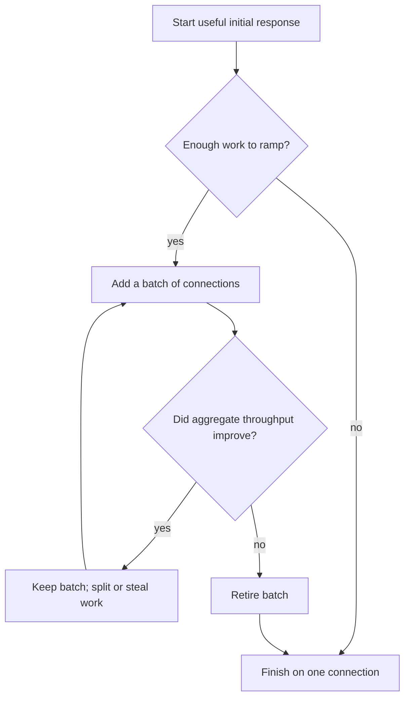

# go-download

[](https://github.com/blacktop/go-download/actions/workflows/go.yml) [](https://pkg.go.dev/github.com/blacktop/go-download) [](http://doge.mit-license.org)

> Fast, resumable downloads for large files. Standard library only.

---

## Features

- Splits files into ranges and downloads them over parallel HTTP/1.1 connections. HTTP/2 is deliberately avoided because it would multiplex the ranges over one TCP connection.
- Lets idle connections take the unfinished tail of slower chunks, similar to aria2's segment allocation.
- Records progress in a `.part.json` sidecar. Before resuming, the downloader checks the server's ETag or Last-Modified value.
- Times out stalled reads, with extra tolerance for flaky links. Range requests resume from the last byte written; a non-range fallback starts over.
- Writes into a preallocated `.part` file at disjoint offsets. The destination is installed atomically only after size and optional checksum verification. A file created at the destination during the download is left alone unless overwrite is enabled.
- Uses only the Go standard library. Progress UIs can implement `Reporter` or use the included `dl` command.

## How it works

The initial `Range: bytes=0-` response becomes the first download stream, so
data starts moving immediately. Short downloads finish on that connection. If
enough data remains, the downloader measures aggregate throughput and adds
HTTP/1.1 connections in batches, doubling the active count at each step. A
batch stays if it improves throughput; otherwise, its workers retire.
Idle workers take the unfinished tail of slower chunks.



Each retry computes its `Range` from the current byte cursor. Data already
written remains useful after a stall, transport error, or worker retirement.

## Install

```bash
go get github.com/blacktop/go-download
```

## Getting started

```go
package main

import (
    "context"
    "fmt"
    "os"
    "os/signal"
    "syscall"

    "github.com/blacktop/go-download"
)

func main() {
    ctx, stop := signal.NotifyContext(context.Background(), syscall.SIGINT, syscall.SIGTERM)
    defer stop()

    dl, err := download.New(nil) // defaults: 8 parts, resume, silent
    if err != nil {
        fmt.Fprintln(os.Stderr, err)
        os.Exit(1)
    }

    res, err := dl.Get(ctx, os.Args[1], "")
    if err != nil {
        fmt.Fprintln(os.Stderr, err)
        os.Exit(1)
    }
    fmt.Printf("saved %s (%d bytes in %s)\n", res.Path, res.Size, res.Elapsed)
}
```

Configure the downloader with `download.Options`:

```go
dl, err := download.New(&download.Options{
    Parts:          8,                // parallel connections
    MinPartSize:    16 << 20,         // never split ranges below 2x this
    ExpectedSHA256: "6ca0e5...",      // verify before the final install
    Reporter:       myProgressUI,     // receive progress events
})
```

For HTTP/3, pass a QUIC `http.RoundTripper`, such as quic-go, through
`Options.Transport`. The core library does not depend on a QUIC implementation.

## CLI

The separate `dl` module includes a multi-bar progress display:

```bash
go install github.com/blacktop/go-download/cmd/dl@latest

dl -p 8 --sha256 020a1e8... https://dl.google.com/go/go1.26.7.darwin-arm64.tar.gz
```

Run the same command after an interruption to resume the download.

## Performance

Parallel parts help when throughput is capped per connection, such as on a
shaped link or throttled CDN edge. If one TCP flow already fills the path,
extra connections only add overhead.

The downloader starts with the initial `Range: bytes=0-` response and measures
its rate after TCP slow start. It then doubles the connection count while each
new batch improves aggregate throughput. An HTTP 429 response, or a batch that
never delivers data, returns the downloader to the last flow count that
worked. On a path with a shared bandwidth cap, it settles back to one stream.

Small downloads do not ramp. The downloader explores only when the remaining
data can supply one `MinPartSize` chunk to every configured part. With the
defaults of 8 parts and 16 MiB per part, that boundary is 128 MiB. On a range
server with a validator, the initial response remains the only connection
below the boundary, so resume still works without another request.

The default small- and large-file benchmarks compare complete download
lifecycles: the stdlib baseline uses the same range request, stages into a
temporary file, calls `Sync`, and renames the result. The shaped-network rows
retain the raw stdlib baseline because transfer time dominates finalization.
These are fresh measurements from an Apple M5 Max with Go 1.27 on August 21,
2026:

| Scenario | Baseline | `go-download` | Result |
|---|---:|---:|---:|
| Default small file, unconstrained loopback (4 MiB) | 6.51 ms | **6.27 ms** | within noise |
| Default large file, unconstrained loopback (128 MiB) | 2.64 GiB/s | **3.14 GiB/s** | **1.19×** |
| Per-connection throttle (64 MiB, raw stdlib; about 26 MB/s per flow) | 26.15 MB/s | **79.95 MB/s** | **3.06×** |
| Shared 32 MB/s cap (raw stdlib) | 34.34 MB/s | 33.40 MB/s | **0.973×** |
| Real WAN, one-flow 100 MiB, paired with curl HTTP/1.1 | paired baseline | paired median | **0.973×** |

The constrained case is what the multipart scheduler is built for. Its 3.06×
result is close to an independent [ipsw](https://github.com/blacktop/ipsw)
benchmark, which measured 3.76× throughput on a constrained path. When all
connections share one cap, the extra batch retires and the transfer returns to
one flow.

There is also a deliberately aggressive 8 MiB diagnostic benchmark configured
with four parts and 1 MiB chunks. It reaches about 1.0 GiB/s, versus roughly
3.0 GiB/s for a raw `http.Get` + `io.Copy`. That is not the default small-file
path, and the raw baseline skips staging, `Sync`, atomic installation, and
resume bookkeeping. It remains in the suite to make multipart overhead visible,
not as a like-for-like product comparison.

WAN results are noisier. The final exact-tree series alternated execution order
for ten rounds, kept every round, and verified the endpoint, validator, size,
and HTTP/1.1 protocol before and after. Individual `go-download`/curl ratios
ranged from 0.844× to 1.109×; the paired median was 0.973×.

Reproduce:

```bash
just bench                 # every loopback benchmark behind the table above

# real-network pair against a public 100 MiB test file:
env DL_BENCH_URL=https://ash-speed.hetzner.com/100MB.bin go test -bench BenchmarkReal -benchtime 3x .
```

## Development

`cmd/dl` pins a published library version. After cloning, run `just setup` once
to create a `go.work` file that points it at the in-tree library. `just check`
runs the same checks as CI.

## License

MIT. See [LICENSE](LICENSE).
