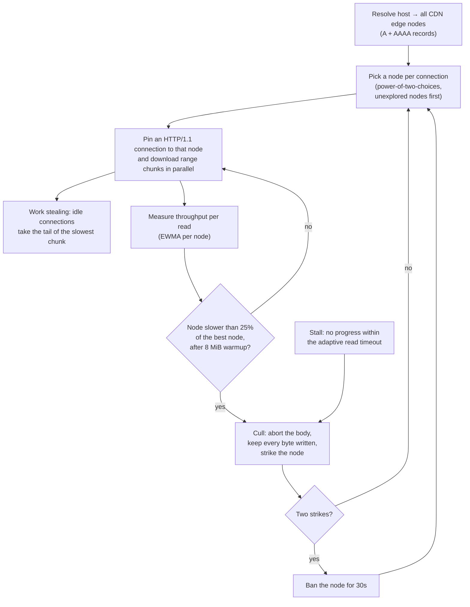

# go-download

[](https://github.com/blacktop/go-download/actions/workflows/go.yml) [](https://pkg.go.dev/github.com/blacktop/go-download) [](http://doge.mit-license.org)

> Download LARGE files as fast as possible. Zero dependencies.

---

## Features

- **Parallel parts** — the file is split into ranges downloaded over parallel HTTP/1.1 connections (HTTP/2 is deliberately avoided: it would multiplex every range onto a single TCP connection)
- **Dynamic work stealing** — fast connections steal the remaining tail of slow ones (aria2-style segment allocation), so one bad connection never drags out the whole download
- **CDN node racing** — when the host resolves to multiple edge nodes, each connection is pinned to one node, per-node throughput is measured (EWMA), and statistically slow nodes are abandoned for better ones
- **Automatic resume** — progress is tracked in a `.part.json` sidecar; an interrupted download picks up where it left off, validated against the server's ETag/Last-Modified
- **Stall detection** — a per-read timeout (adaptive on flaky links) aborts and retries hung connections; retries resume mid-range, never re-downloading bytes
- **Safe by construction** — bytes are staged in a preallocated `.part` file written at disjoint offsets; the destination path is only installed atomically after size (and optional checksum) verification, without replacing a late-created file unless overwrite is enabled
- **Zero dependencies** — the library is pure standard library; bring your own progress UI via the `Reporter` interface (or use the `dl` CLI)

## How it works

A CDN hostname usually resolves to several edge nodes with very different
speeds. Instead of letting the OS pick one, every parallel connection is
pinned to its own node, each node's throughput is measured continuously, and
statistically bad nodes are abandoned for better ones:



Culling costs nothing: the aborted chunk resumes mid-range on the next node
(`Range` is recomputed from the byte cursor), so no byte is ever downloaded
twice — the download simply migrates toward whichever edge nodes are fastest
right now.

## Performance

Parallel parts pay off when the bottleneck is **per connection** — per-flow
shaping, throttled CDN edges, long fat networks. When a single TCP flow
already saturates the path there is nothing to parallelize, so the engine
**ramps adaptively**: it starts with one connection, measures a slow-start
burn-in baseline, then adds connections in doubling steps only while each
step improves aggregate throughput (a server 429 also freezes the ramp).
On a saturated line the download transparently behaves like a single-stream
client instead of competing with itself.

The in-repo benchmarks measure both regimes against a stdlib `http.Get` +
`io.Copy` baseline (Apple M5 Max, Go 1.26, 2026-08-20):

| Scenario | `http.Get` | `go-download` | |
|---|---|---|---|
| Per-connection throttle, loopback (64 MiB, each connection capped ~28 MB/s) | 28 MB/s | **92–99 MB/s** (ramps to 4 parts) | **~3.5×** |
| Unconstrained loopback (8 MiB — no bottleneck to parallelize) | ~2.5 GB/s | ~0.9 GB/s | 0.36× |
| Real WAN, single-flow-saturated line (Hetzner `100MB.bin`, ~130 Mbit link) | ~13–15 MB/s | ~8–10 MB/s (ramp stops at 2) | ~0.7× |

The constrained row is the design target and matches an independent
measurement by [ipsw](https://github.com/blacktop/ipsw), whose engine
benchmarks recorded 3.76× throughput on constrained paths. The other rows
are the honest fine print: with no per-flow limit the engine's probe,
staging, verification, fsync, and the one probed-but-kept extra connection
cost ~20–30% on a saturated WAN link (the ramp currently only stops adding
connections; it does not yet retire a probed flow that failed to pay).
Loopback numbers mostly measure fixed overhead, and real-network results
vary run to run with the line itself.

Reproduce:

```bash
just bench                 # loopback pairs: unconstrained + per-connection throttle

# real-network pair against a de facto speed-test file (Hetzner/thinkbroadband/Tele2):
DL_BENCH_URL=https://ash-speed.hetzner.com/100MB.bin \
    go test -bench BenchmarkReal -benchtime 3x .
```

## Install

```bash
go get github.com/blacktop/go-download
```

## Getting Started

```go
package main

import (
    "context"
    "fmt"
    "os"
    "os/signal"
    "syscall"

    "github.com/blacktop/go-download"
)

func main() {
    ctx, stop := signal.NotifyContext(context.Background(), syscall.SIGINT, syscall.SIGTERM)
    defer stop()

    dl, err := download.New(nil) // defaults: 8 parts, resume, silent
    if err != nil {
        fmt.Fprintln(os.Stderr, err)
        os.Exit(1)
    }

    res, err := dl.Get(ctx, os.Args[1], "")
    if err != nil {
        fmt.Fprintln(os.Stderr, err)
        os.Exit(1)
    }
    fmt.Printf("saved %s (%d bytes in %s)\n", res.Path, res.Size, res.Elapsed)
}
```

All knobs live on `download.Options`:

```go
dl, err := download.New(&download.Options{
    Parts:          8,                // parallel connections
    MinPartSize:    16 << 20,         // never split ranges below 2x this
    ExpectedSHA256: "6ca0e5...",      // verify before the final install
    Reporter:       myProgressUI,     // receive progress events
})
```

HTTP/3? Plug a QUIC `http.RoundTripper` (e.g. quic-go) into `Options.Transport` — the library stays dependency-free.

## CLI

The repo ships a `dl` command (separate module) with multi-bar progress:

```bash
go install github.com/blacktop/go-download/cmd/dl@latest

dl -p 8 --sha256 020a1e8... https://dl.google.com/go/go1.26.7.darwin-arm64.tar.gz
```

Interrupted? Run the same command again — it resumes.

## Development

`cmd/dl` pins a published library version; run `just setup` once after
cloning to create a `go.work` so it builds against the in-tree library.
`just check` runs everything CI runs.

## License

MIT License - see [LICENSE](LICENSE) for details.
