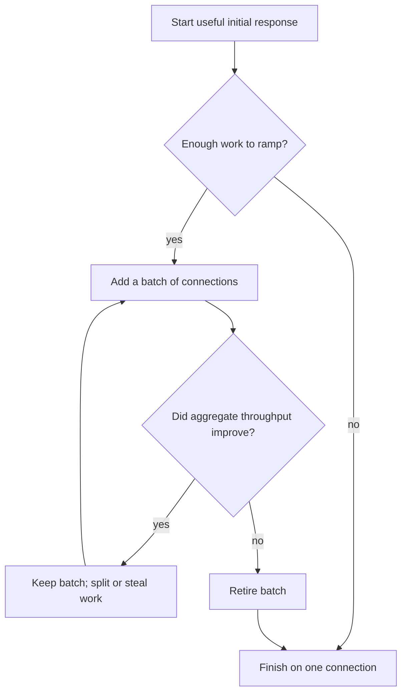

# go-download

[](https://github.com/blacktop/go-download/actions/workflows/go.yml) [](https://pkg.go.dev/github.com/blacktop/go-download) [](http://doge.mit-license.org)

> Fast, resumable downloads for large files. Standard library only.

---

## Features

- Parallel HTTP/1.1 range downloads that add connections only while they help.
- Opt-in direct-host placement across resolved CDN addresses, with a 300 ms
  fallback race and conservative replacement of persistently slow addresses.
- Work stealing: idle connections can finish the slow tail of another range.
- Safe resume using a `.part.json` sidecar and ETag or Last-Modified validation.
- Stall recovery from the last byte written. Non-range servers fall back to a clean restart.
- Atomic installation after size and optional checksum (SHA-256/SHA-1) verification. Existing destinations are preserved unless overwrite is enabled.
- Standard library only. Progress UIs can implement `Reporter` or use the `dl` command.

## How it works

The initial `Range: bytes=0-` response is the first download stream. Short
downloads finish there. For larger files, the downloader measures throughput,
adds connections in batches, and retires a batch when it stops helping. Idle
workers can take the unfinished tail of slower ranges.
Ranges use separate HTTP/1.1 connections; HTTP/2 would put them back on one TCP
connection.



Retries start from the current byte cursor, so completed work survives stalls,
transport errors, and worker retirement.

## Install

```bash
go get github.com/blacktop/go-download
```

## Getting started

```go
package main

import (
    "context"
    "fmt"
    "os"
    "os/signal"
    "syscall"

    "github.com/blacktop/go-download"
)

func main() {
    ctx, stop := signal.NotifyContext(context.Background(), syscall.SIGINT, syscall.SIGTERM)
    defer stop()

    dl, err := download.New(nil) // defaults: 8 parts, resume, silent
    if err != nil {
        fmt.Fprintln(os.Stderr, err)
        os.Exit(1)
    }

    res, err := dl.Get(ctx, os.Args[1], "")
    if err != nil {
        fmt.Fprintln(os.Stderr, err)
        os.Exit(1)
    }
    fmt.Printf("saved %s (%d bytes in %s)\n", res.Path, res.Size, res.Elapsed)
}
```

Configure the downloader with `download.Options`:

```go
dl, err := download.New(&download.Options{
    Parts:               8,           // parallel connections (cap)
    MinParts:            1,           // opened eagerly; never retired below
    EnableNodeSelection: true,        // opt into CDN address placement
    ResumeID:            "",          // stable resume identity for signed URLs
    MinPartSize:         16 << 20,    // never split ranges below 2x this
    ExpectedSHA256:      "6ca0e5...", // verify before the final install
    Reporter:            myProgressUI,
})
```

One downloader can serve a whole transport/authentication session. Put
artifact-specific headers, checksums, reporters, and signed-URL resume identity
on each request; request header values replace option-level values with the
same canonical name:

```go
res, err := dl.Do(ctx, &download.Request{
    URL:      signedURL,
    Dest:     destination,
    Headers:  http.Header{"Authorization": {"Bearer " + token}},
    ResumeID: stableOriginAndPath,
})
```

`Do` snapshots the request header map and its value slices before networking,
so the caller may safely reuse or mutate them after invocation. Sensitive
headers retain `net/http`'s redirect protections. An empty request `ResumeID`
inherits `Options.ResumeID`; validators and expected size still decide whether
partial data is reusable.

When explicitly enabled, node selection applies only to eligible multipart
downloads using the built-in direct transport and at least two discovered
addresses. It preserves the URL hostname for HTTP, TLS SNI, cookies, and
certificate verification. Single-flow and small-file runs, literal-IP URLs,
proxies, custom transports, one-address hosts, and resolver failures retain the
ordinary transport path.

After ramping settles, culling compares complete, stable ten-second windows.
The best address must deliver at least 8 MiB of aggregate evidence; a candidate
needs the complete time window, not the same byte floor. An address below 25%
of the best per-connection rate for two evaluations is migrated without
charging retry budget, then receives a later passive recovery probe.

For HTTP/3, pass a QUIC `http.RoundTripper`, such as quic-go, through
`Options.Transport`. The core library does not depend on a QUIC implementation.

## CLI

The separate `dl` module includes a multi-bar progress display:

```bash
go install github.com/blacktop/go-download/cmd/dl@latest

dl -p 8 --sha256 020a1e8... https://dl.google.com/go/go1.26.7.darwin-arm64.tar.gz

# Opt into multi-address placement for an eligible direct CDN host:
dl -p 8 --enable-node-selection https://cdn.example.com/large-file
```

Run the same command after an interruption to resume the download.

Resume identity is the request URL by default, query included. When the URL
carries rotating signed credentials (`?accessKey=…`, CDN tokens) but names
the same object, pass `--resume-id` with something stable such as the scheme,
host, and path; the sidecar is then reused under a refreshed URL while
ETag/Last-Modified and size still decide whether the staged bytes are current.

## Performance

Small files stay on the initial connection. Larger files add connections only
while aggregate throughput improves; shared-cap links settle back to one.
With the defaults (`Parts: 8`, `MinPartSize: 16 MiB`), ramping begins at 128 MiB.

On hosts known to be per-flow limited, the ramp's single-flow warm-up costs
real time on mid-size objects. `MinParts` opens that many connections at
once and the governor never retires below it (`MinParts == Parts` is fixed
parallelism); an explicit 429 still sheds eager flows. See the `Options`
documentation for how small objects clamp the floor.

`Options.Policy` applies such choices per resource: it is called with the
byte-serving URL (after redirects) before any additional range request, and
its zero fields keep the `Options` values. `Result.FinalURL` reports the same
URL. When a policy only lowers `Parts`, an inherited `MinParts` is clamped to
fit; explicitly returning `MinParts > Parts` fails that download.

```go
Policy: func(finalURL string) download.Concurrency {
    u, err := url.Parse(finalURL)
    if err != nil {
        return download.Concurrency{}
    }
    host := download.NormalizeHost(u.Hostname())
    const appleCDN = "cdn-apple.com"
    if host == appleCDN || strings.HasSuffix(host, "."+appleCDN) {
        // fixed parallelism, smaller splits
        return download.Concurrency{Parts: 8, MinParts: 8, MinPartSize: 8 << 20}
    }
    return download.Concurrency{}
},
```

Apple M5 Max, Go 1.27, August 21, 2026 (6 runs each, benchstat medians):

| Workload | Baseline | `go-download` | Result |
|---|---:|---:|---:|
| 4 MiB loopback | 7.06 ms | 7.28 ms | within noise |
| 128 MiB loopback | 2.05 GiB/s | 2.73 GiB/s | **1.33×** (±15% run noise) |
| 64 MiB per-flow cap, `Parts: 4` | 28.6 MB/s | 87.2 MB/s | **3.05×** |
| 64 MiB per-flow cap, `Parts: 8`, `MinParts: 8` | 120.9 MB/s (default ramp) | 216.7 MB/s | **1.79×** |
| Shared 32 MB/s cap | 34.4 MB/s | 33.5 MB/s | **0.973×** |
| 100 MiB WAN | curl HTTP/1.1 | paired median | **0.973×** |

The `MinParts` row compares the same engine with and without the floor: on a
per-flow-limited link the default ramp spends the first part of a mid-size
transfer proving each connection pays. The WAN row predates `MinParts` and
was not re-run (it needs `DL_BENCH_URL` and a live network).

The loopback comparisons cover the same durable lifecycle: ranged request,
temporary file, `Sync`, and atomic rename. The shaped-link rows use a raw stdlib
baseline because transfer time dominates. The WAN run alternated execution
order, kept every round, and checked the endpoint, validator, size, and protocol.
Individual WAN ratios ranged from 0.844× to 1.109×.

### Node-placement boundary

Node placement is opt-in because distributing flows across every resolved
address is not universally faster than staying on the election address. A
held-out public Apple CDN sweep on August 23, 2026 used three interleaved
45-second rounds per configuration:

| Parts/MinParts | Placement | Median MiB/s |
|---|---:|---:|
| 8/8 | off | 13.31 |
| 4/4 | off | 12.23 |
| 4/4 | on | 11.25 |
| 8/8 | on | 10.47 |
| 1/1 | off | 9.22 |

The 8/8 enabled/disabled ratios were 0.94, 0.79, and 0.74. Placement used all
four resolved addresses, including one whose per-connection rate was roughly
three times slower than the fastest. That spread remained above the
conservative 25% culling threshold, so migration correctly did not fire, but
the diversified run was slower.

Conversely, the deterministic 100:1 slow-node fixture migrated work losslessly
and completed in about 0.667× the disabled wall time, a 1.50× speedup. Local
paired benchmarks found inactive paths unchanged and equal-node wall time
neutral; equal-node placement used about 9.6% more allocations. These results
support opt-in placement for known multi-address bottlenecks, not a universal
fastest configuration.

An aggressive 8 MiB multipart benchmark remains in the suite to expose
overhead. It is intentionally excluded above because its raw `http.Get` baseline
skips staging, `Sync`, atomic installation, and resume bookkeeping.

Reproduce the checked-in local fixtures:

```bash
just bench # loopback throughput and placement overhead benchmarks

# lossless 100:1 migration oracle (wall time is diagnostic, not a test gate):
go test -run '^TestSlowNodeCullingMigratesLosslesslyAtHundredToOne$' -count=1 .

# real-network pair against a public 100 MiB test file:
env DL_BENCH_URL=https://ash-speed.hetzner.com/100MB.bin go test -bench BenchmarkReal -benchtime 3x .
```

## Development

`cmd/dl` pins a published library version. After cloning, run `just setup` once
to create a `go.work` file that points it at the in-tree library. `just check`
runs the same checks as CI.

## License

MIT. See [LICENSE](LICENSE).
